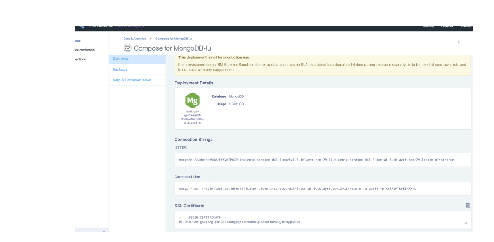
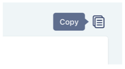
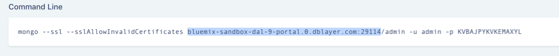
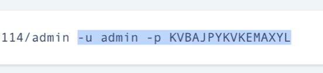

---

copyright:
  years: 2016,2017
lastupdated: "2017-08-03"
---

{:new_window: target="_blank"}
{:shortdesc: .shortdesc}
{:screen: .screen}
{:codeblock: .codeblock}
{:pre: .pre}
{:tip: .tip}

# Connecting with Robo3T

Robo 3T (formerly Robomongo) is a free lightweight GUI for MongoDB. Its main focus is running queries, creating indexes and viewing documents.

1. Install [Robo3T](https://robomongo.org/).
2. Go to the _Overview_ tab of your service dashboard. All the information you need to connect using Robo3T can be found on this tab.

  

3. Save the SSL certificate for your service. First, copy the SSL certificate using the copy button in the top-right corner of the SSL certificate panel:

    

  Then, using your preferred text editor, create a new file, paste the SSL certificate contents into the file, and save the file.

4. Open Robo3T and navigate to the _Connection Settings_ tab. To complete the fields here you'll need a host name and port number. You can find these values in the command line panel back in your _Overview_ tab:

  

5. Copy the values into the Address fields in the _Connection Settings_ tab.

  Leave the _Type_ setting as "Direct Connection"
  {: tip}

6. Open the _Authentication_ tab. To complete the fields here you'll need a user name and password. You can find these values at the end of the Command Line string in the command line panel back in your _Overview_ tab:

  

7. Make sure the _Perform authentication_ box is checked, and enter the Use Name and Password values from your command line string.

8. Open the _SSL_ tab. Make sure the _Use SSL protocol_ box is checked, and _Authentication Method_ is set to "Use CA Certificate".

9. Use the _CA Certificate_ field to enter or browse to the location of the SSL certificate file you created.

10. Click **Save** to finish.

