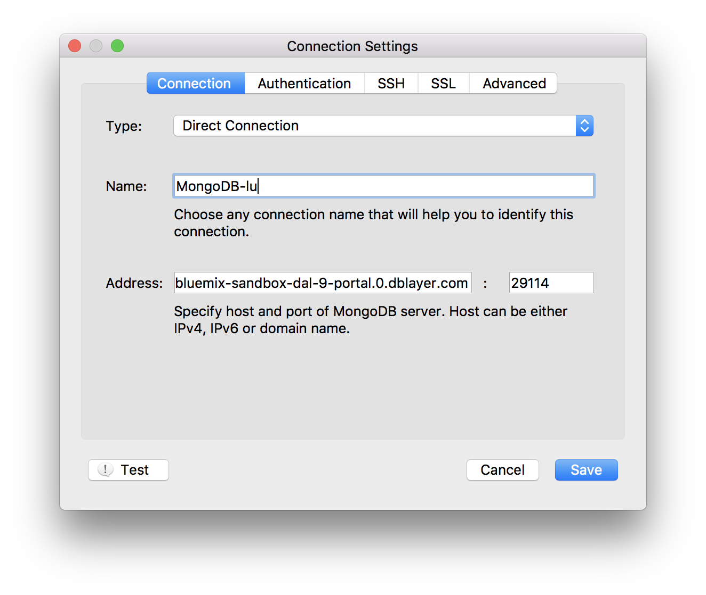
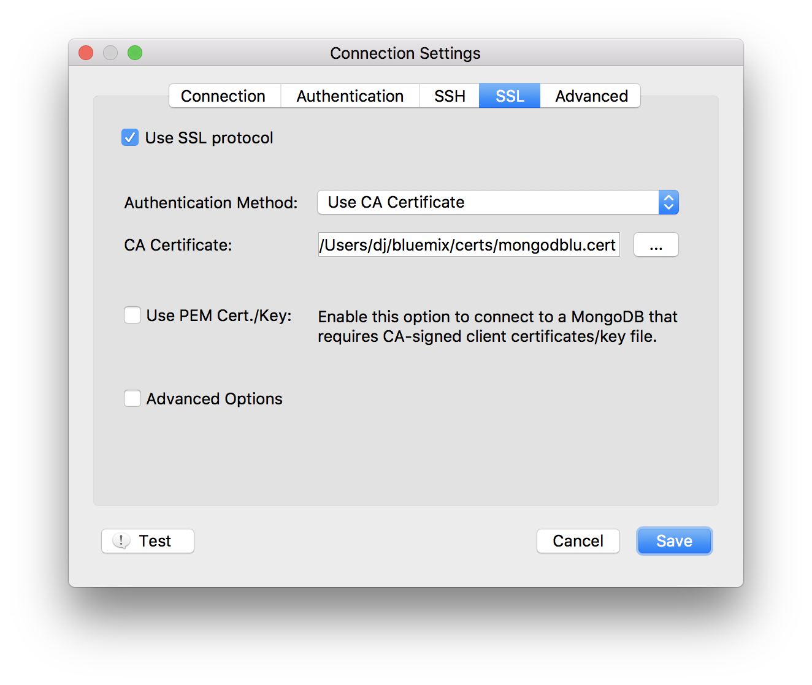

---

copyright:
  years: 2016,2018
lastupdated: "2017-08-03"

subcollection: compose-for-mongodb

---

{:new_window: target="_blank"}
{:shortdesc: .shortdesc}
{:screen: .screen}
{:codeblock: .codeblock}
{:pre: .pre}
{:tip: .tip}

# Connecting with Robo3T

Robo 3T (formerly Robomongo) is a free lightweight GUI for MongoDB. Its main focus is running queries, creating indexes, and viewing documents.

1. Install [Robo3T](https://robomongo.org/).
2. Go to the _Overview_ page of your service dashboard. All the information that you need to connect by using Robo3T can be found on this tab.

  

3. In the _Connection Strings_ pane, click **SSL Certificates** to open the SSL Certificates tab. Save the SSL certificate for your service. First, copy the SSL certificate by using the copy button in the SSL certificate pane:

    

  Then, using your preferred text editor, create a new file, paste the SSL certificate contents into the file, and save the file.

4. Open Robo3T and navigate to the _Connection Settings_ tab. To complete the fields here, you need a host name and port number. Back on the _Overview_ page of your service dashboard, you can find these values in the Command Line tab, in the _Connection Settings_ pane.

5. Copy the values into the Address fields in the _Connection Settings_ tab.

  

  Leave the _Type_ setting as "Direct Connection"
  {: tip}

6. Open the _Authentication_ tab. To complete the fields here, you need a user name and password. Back on the _Overview_ page of your service dashboard, you can find your user name and password in the Command Line tab, in the _Connection Settings_ pane.

7. Make sure that the Perform authentication box is checked, and enter the Use Name and Password values from your command line string.

  

8. Open the _SSL_ tab. Make sure that _Use SSL protocol_ is checked, and that _Authentication Method_ is set to "Use CA Certificate".

  

9. Use the _CA Certificate_ field to enter or browse to the location of the SSL certificate file that you created.

10. Click **Save** to finish.

