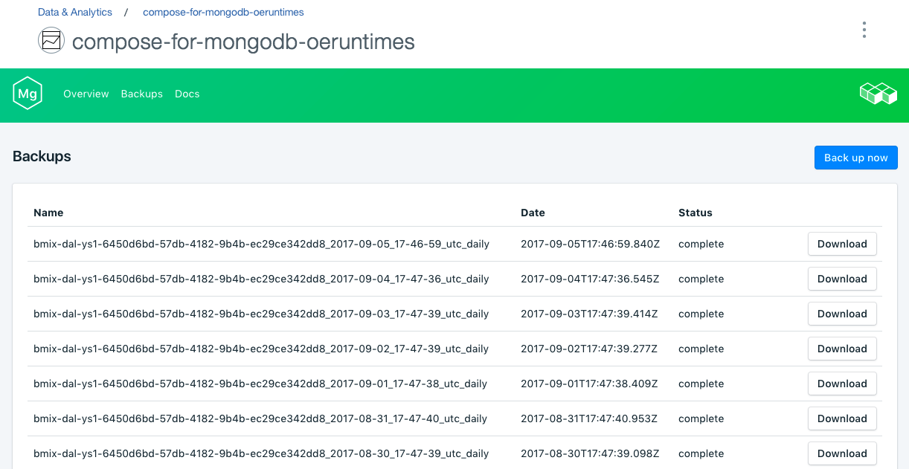

---

copyright:
  years: 2017
lastupdated: "2017-09-07"
---

{:new_window: target="_blank"}
{:shortdesc: .shortdesc}
{:screen: .screen}
{:codeblock: .codeblock}
{:pre: .pre}
{:tip: .tip}

# Backups
{: #backups}

You can create and download backups from the *Manage* page of your service dashboard. Both scheduled and manual backups are available.

## Viewing existing backups

Daily backups of your database are automatically scheduled. To view your existing backups, navigate to the *Manage* page of your service dashboard. 



## Creating a backup on demand

As well as scheduled backups you can create a backup manually. To create a manual backup, navigate to the *Manage* page of your service dashboard and click *Backup now*.

## Downloading a backup

To download a backup, navigate to the *Manage* page of your service dashboard and click *Download* in the corresponding row for the backup you wish to download.

## Using a backup with a local database

You can use your {{site.data.keyword.composeForMongoDB}} backup to run a local copy of your database.

To get a local restore of your databases and data:

1. Download a backup from your service dashboard.
2. Install MongoDB and MongoDB tools locally.
3. Extract the data from the backup into a new directory.
4. Start a local MongoDB instance with the command `mongod --dbpath ./db` where './db' is the directory that contains the extracted data.


## Restoring a backup to your Compose for MongoDB service

To restore your {{site.data.keyword.ComposeForMongoDB}} backup to your service you need to run `mongodump` against the local database, and then use `mongorestore`, which takes the data from `mongodump` to send a series of inserts to the target database, but ignoring duplicate records. If your data is largely "write once", this is a good way to merge backup data with production.

1. Make sure you have MongoDB running locally, and that it uses the {{site.data.keyword.ComposeForMongoDB}} backup.
2. Run `mongodump` against the local database instance:

  ```
  mongodump --ssl --sslAllowInvalidCertificates --host <hostname> --port <portnumber> --db <database_name> -u <username> -p <password>
  ```

3. Run `mongorestore`. To use the data taken from mongodump, using mongorestore, you can use the local host, port number, and user access settings to get your data locally.

  If you have the MongodDB Tools installed (or a local install of MongoDB), you can run `mongorestore` against your target database. The `dump/` should be in the directory relative to your current working path, and the database_name will be the database you exported from. 

  ```
  mongorestore --ssl --sslAllowInvalidCertificates --host <hostname> --port <portnumber> --db <database_name> -u <username> -p<password> dump/database_name
  ```

  In this case the username and password is a user created in that specific database. If you use the _admin_ database for user administration and permissions the command will look like this:

  ```
  mongorestore --ssl --sslAllowInvalidCertificates --host <hostname> --port <portnumber> --db <database_name> -u <username> -p<password> --authenticationDatabase admin dump/database_name
  ```

  **Note:** The lack of a space between the -p and your database password is significant.

This process will not apply updates that may have happened since the backup was made, and will reinsert any since deleted documents.
{: .tip}
