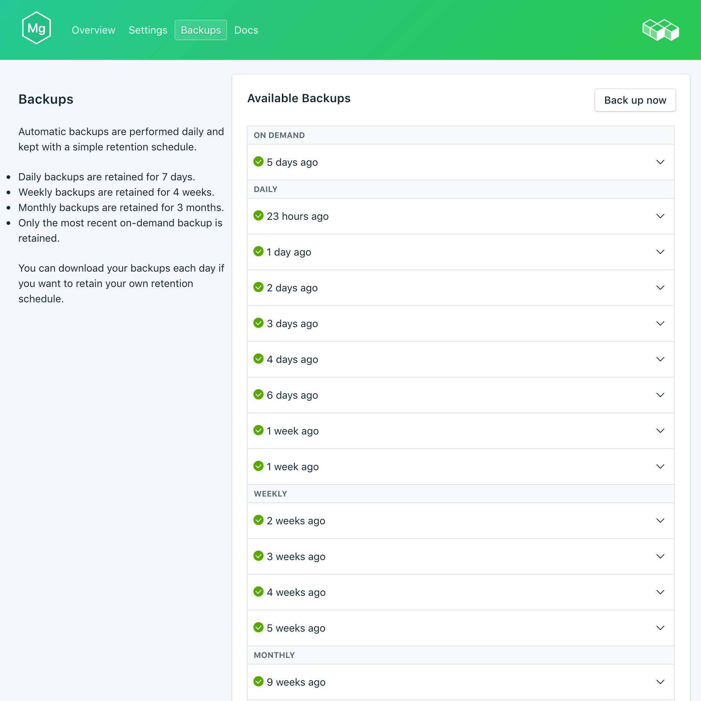
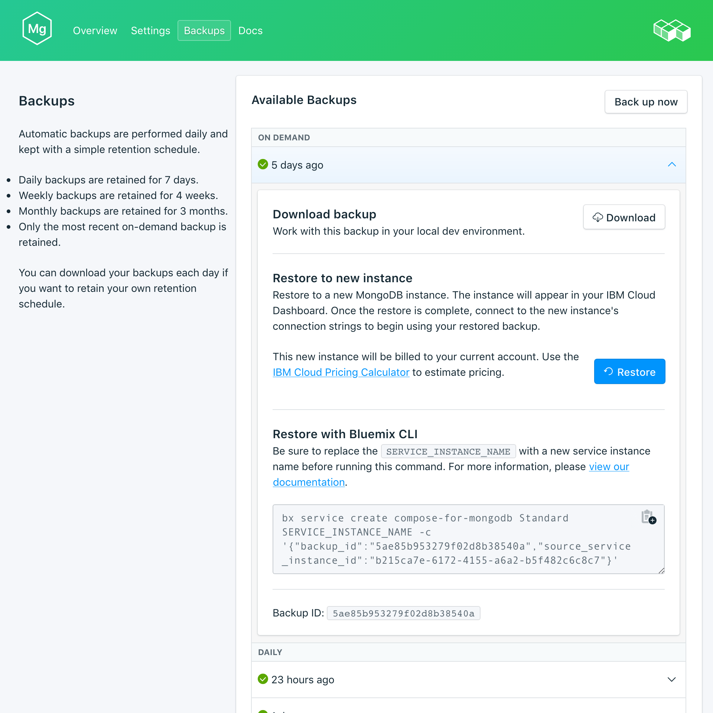

---

copyright:
  years: 2017
lastupdated: "2017-09-07"
---

{:new_window: target="_blank"}
{:shortdesc: .shortdesc}
{:screen: .screen}
{:codeblock: .codeblock}
{:pre: .pre}
{:tip: .tip}

# Backups
{: #backups}

You can create and download backups from the *Manage* page of your {{site.data.keyword.composeForMongoDB_full}} service dashboard. Both scheduled and manual backups are available.

## Viewing existing backups

Daily backups of your database are automatically scheduled. To view your existing backups, navigate to the *Manage* page of your service dashboard. 

Click on the corresponding row to expand the options for any available backup.
  
 

## Creating a backup on demand

As well as scheduled backups you can create a backup manually. To create a manual backup, navigate to the *Manage* page of your service dashboard and click *Backup now*.

## Downloading a backup

To download a backup, navigate to the *Manage* page of your service dashboard and click *Download* in the corresponding row for the backup you wish to download.

## Using a backup with a local database

You can use your {{site.data.keyword.composeForMongoDB}} backup to run a local copy of your database.

To get a local restore of your databases and data:

1. Download a backup from your service dashboard.
2. Install MongoDB and MongoDB tools locally.
3. Extract the data from the backup into a new directory.
4. Start a local MongoDB instance with the command `mongod --dbpath ./db` where './db' is the directory that contains the extracted data.

## Restoring a backup

To restore a backup to a new service instance, follow the steps to view existing backups, then click in the corresponding row to expand the options for the backup you want to download. Click on the **Restore** button. A message is displayed to let you know that a restore has been initiated. The new service instance will automatically be named "mongodb-restore-[timestamp]", and appears on your dashboard when provisioning starts.
