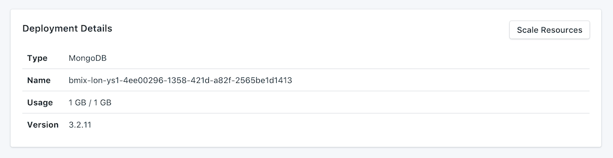

---

Copyright:
  Years: 2017
lastupdated: "2017-09-07"
---

{:new_window: target="_blank"}
{:shortdesc: .shortdesc}
{:screen: .screen}
{:codeblock: .codeblock}
{:pre: .pre}

# Service Overview

The _Overview_ page shows you information about your Bluemix Compose database. The overview includes essential identifying information and current resource usage. You'll also find a section for connection strings that you can use with tools or make use of tools to connect to your database.

## Deployment Details

The _Deployment Details_ panel shows details of your service.



### Type

The type of database that is offered by the service; in this case `MongoDB`.

### Name

An internal identifier for the service.

### Usage

The size of your database and the amount of storage provided by your service plan.

### Version

The database version that your service uses.

### Scale Resouces

If your service needs additional storage, or you want to reduce the amount of storage allocated to your service, you can do this by scaling resources. See [Scaling Resources](./dashboard-scaling-resources.html) for more details.

## Connection Strings

You can find available connection strings for your service in a set of tabs in the _Connection Strings_ panel. You can find out how to use the connection strings to connect to your service in [Connecting an external application](./connecting-external.html).

### HTTPS

The **HTTPS** connection string can be used by some client libraries and contains all the information needed for other libraries to connect.

### Connection String

You can use your connection string directly in an application to connect to {{site.data.keyword.composeForMongoDB}} or set it as an environment variable. To do this, execute the following in the shell:

```
export MONGODB_URL="<CONNECTION STRING>"
```

### Command Line

The **Command Line** is a preformatted command which will invoke `mongo` with the correct parameters. To use it, you'll need to have mongo tools installed on the local system. You can find out more about how to do this in [Connecting an external application](./connecting-external.html).

### SSL Certificate

Your Compose Bluemix service provides you with an SSL certificate that you can use to connect to your database.