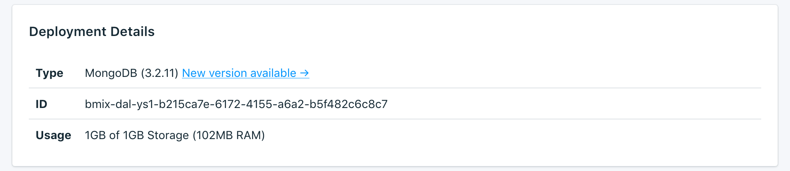

---

Copyright:
  years: 2017,2018
lastupdated: "2018-05-07"

subcollection: compose-for-mongodb

---

{:new_window: target="_blank"}
{:shortdesc: .shortdesc}
{:screen: .screen}
{:codeblock: .codeblock}
{:pre: .pre}

# Service Overview
{: #dashboard-overview}

The _Overview_ page shows you information about your {{site.data.keyword.cloud}} Compose database. The overview includes essential identifying information and current resource usage. It also contains a section for connection strings that you can use to connect to your database.

## Deployment Details

The _Deployment Details_ panel shows details of your service.



### Type

The type of database that is offered by the service, and the database version that your service uses. If a more recent database version is available, a notification is displayed, together with a link to the [Upgrade version](/docs/services/ComposeForMongoDB?topic=compose-for-mongodb-dashboard-settings#upgrade-version) section of your service dashboard.

### ID

An internal identifier for the service.

### Usage

The size of your database and the amount of storage that is provided by your service plan.

## Recent Tasks

Making administrative changes to your service (such as scaling, or taking a manual backup) starts a task. While the task is running, the _Recent Tasks_ panel shows the task name and a progress bar.

## Connection Strings

You can find available connection strings for your service in a set of tabs in the _Connection Strings_ panel. You can find out how to use the connection strings to connect to your service in [Connecting an external application](/docs/services/ComposeForMongoDB?topic=compose-for-mongodb-external-app).

### HTTPS

The **HTTPS** connection string can be used by some client libraries and contains all the information that is needed for other libraries to connect.

### Connection String

You can use your connection string directly in an application to connect to {{site.data.keyword.composeForMongoDB}} or set it as an environment variable. To set the connection string in your environment, execute the `export` command in the shell:

```
export MONGODB_URL="<CONNECTION STRING>"
```

### Command Line

The **Command Line** is a preformatted command, which invokes `mongo` with the correct parameters. To use it, you need the Mongo tools installed on the local system. You can find out more in [Connecting an external application](/docs/services/ComposeForMongoDB?topic=compose-for-mongodb-external-app).

### SSL Certificate

Your Compose {{site.data.keyword.cloud_notm}} service provides you with an SSL certificate that you can use to connect to your database.

## Security 

Encryption at rest is enabled for all {{site.data.keyword.composeForMongoDB}} deployments.

## Instance Administration API

You can manage your {{site.data.keyword.composeForMongoDB}} service through the {{site.data.keyword.cloud_notm}} Compose API.

### Foundation Endpoint

The foundation endpoint is composed of the region the service resides in and the service instance ID. It is at the start of every endpoint.

### Deployment ID

The deployment ID is necessary for most calls, and identifies the specific deployment instance.

### Reference

For more documentation and reference for using the {{site.data.keyword.cloud_notm}} Compose API, across all {{site.data.keyword.cloud_notm}} Compose services, read [The {{site.data.keyword.cloud_notm}} Compose API](https://www.compose.com/articles/the-ibm-cloud-compose-api/).
