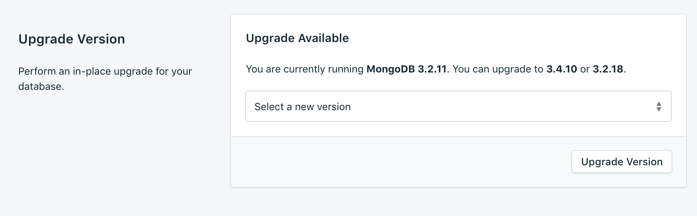
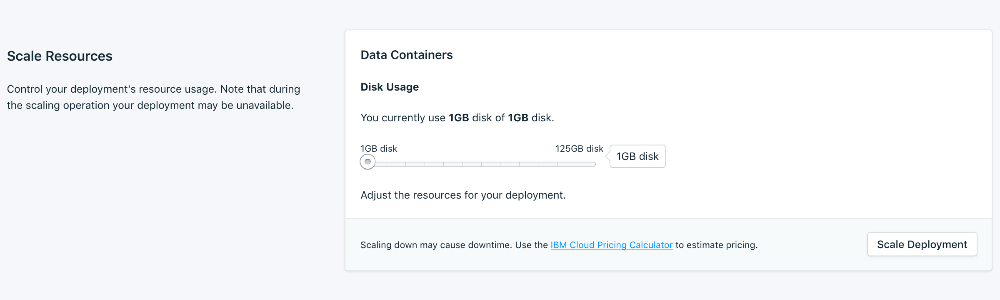

---

Copyright:
  years: 2017,2018
lastupdated: "2017-11-20"

keywords: mongodb, compose

subcollection: ComposeForMongoDB

---

{:new_window: target="_blank"}
{:shortdesc: .shortdesc}
{:screen: .screen}
{:codeblock: .codeblock}
{:pre: .pre}
{:tip: .tip}

# Settings
{: #dashboard-settings}

These features allow you to adapt your {{site.data.keyword.composeForMongoDB}} service to better suit your needs and requirements.

## Upgrade Version

If a new version of the database is available, a drop-down menu appears, from which you can select which version you would like to upgrade to. Otherwise, your service is on the newest version available, and the pane displays the current version information.

## Scaling Resources

You can increase or reduce the amount of storage that is allocated to your service by scaling resources.

1. Go to your service's _Overview_ page.
2. Click **Scale Resources** in the _Deployment Details_ pane. The Scale Resources page opens.

  

3. Adjust the slider to increase or reduce the storage that is allocated to the {{site.data.keyword.composeForMongoDB}} service. Move the slider to the left to reduce the amount of storage, or move it to the right to increase the storage.
4. Click **Scale Deployment** to trigger the rescaling and return to the dashboard overview. 
  
When the scaling is complete the _Deployment Details_ pane updates to show the current usage and the new value for the available storage.

## Whitelists

If you want to restrict access, to your databases, you can whitelist specific IP addresses or ranges of IP addresses on your service. When the whitelist is empty, it is disabled and the deployment accepts connections from any system on the internet.

### IP addresses
The *IP* field can take a single complete IPv4 address or IPv6 address with or without a netmask. Without a netmask, incoming connections must come from exactly that IP address. 

Although the *IP* field allows for IPv6, no Compose deployments are currently available to IPv6 networking, so these addresses cannot be filtered on.

### Netmasks

Use a netmask to allow a connection from a specified range of IP addresses. The IP address must be fully specified, which means entering, for example, 192.168.1.0/24 rather than 192.168.1/24.

### Description
The *Description* can be any user-significant text for identifying the whitelist entry - a customer name, project identifier, or employee number, for example. The description field is required.

### Compose Services
Whitelist entries are automatically added to Compose's servers to allow them to connect.

### Removal
To remove an IP address or netmask from the Whitelist, click *Remove* next to the IP address.
When all entries on the whitelist are removed, the whitelist is disabled and all IP addresses are accepted by the TCP access portals or Mongos router portals.
