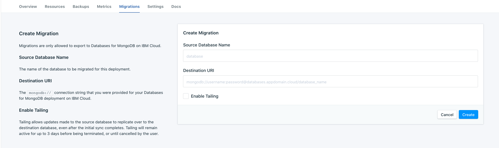

---

copyright:
  years: 2020
lastupdated: "2020-02-12"

keywords: mongodb, compose, migrating, 

subcollection: compose-for-mongodb

---

{:new_window: target="_blank"}
{:shortdesc: .shortdesc}
{:screen: .screen}
{:codeblock: .codeblock}
{:pre: .pre}
{:tip: .tip}

# Migrating to Databases for MongoDB

To ease the transition from {{site.data.keyword.composeForMongoDB}} to {{site.data.keyword.databases-for-mongodb_full}}, use the migration tool available on your {{site.data.keyword.composeForMongoDB}} deployment. The tool moves both your data and indexes to a new {{site.data.keyword.databases-for-mongodb}} deployment.

Migrations are repeatable. You can perform a single migration to a new {{site.data.keyword.databases-for-mongodb}} deployment, test it out, tear it down, and then perform another migration. In the meantime, your applications can continue running on your {{site.data.keyword.composeForMongoDB}} deployment.

All migrations are hosted on Softlayer in the `us-south` region. The migration provisions a custom service that reads from your source database and writes to your destination database. This service is stateless and will terminate when the migration is complete. If tailing is enabled, then the migration service will persist a transaction log on disk. This log guarantees a reliable migration that will successfully resume in the event of an interruption. The transaction log lasts the duration of the migration and then is deleted. If you are migrating a {{site.data.keyword.composeForMongoDB}} deployment in the `eu-de` region, you may not be able to use this tool.  If you have any questions, please [contact support](https://cloud.ibm.com/unifiedsupport/cases). 

## Setting up a Migration

Create a new {{site.data.keyword.databases-for-mongodb}} deployment from the [catalog page](https://cloud.ibm.com/catalog/services/databases-for-mongodb). 

The default major version on IBM Cloud is MongoDB 4.x. You CAN use migrate and upgrade to version 4.x, but you should ensure that your application is compatible before doing so. Otherwise, you can provision version 3.x on IBM Cloud.
{: .tip}

Once the deployment is available, [set its admin password](/docs/services/databases-for-mongodb?topic=databases-for-mongodb-admin-password). Use the connection string and the admin username and password to perform the migration.

## Performing the Migration

In the _Migrations_ tab of your {{site.data.keyword.composeForMongoDB}} deployment, start a new migration by clicking **Create Migration**.

Migrations are done in a database-by-database manner. The _Source Database Name_ database is the one of the databases on your deployment that you want to migrate. The Destination URI is the Connection String of your {{site.data.keyword.databases-for-mongodb}} deployment in the specified format. The `database_name` at the end of the URI does need to be specified, so if you want your database to have the same name after migration, you need to fill it in here.

You will need to recreate the users on the databases you migrate. User data is not carried over in the migration.
{: .tip}

(Optional) If you want to keep your application running while you migrate, enable Tailing. Tailing will push changes to the source database to the new database after the migration of existing data is finished. Once the tailing has caught up with the source database, you can then switch your application to connect to your new database.

Otherwise you can do your migration in one operation, without Tailing enabled.

Click **Create** to begin the migration.

## Tailing

Tailing takes changes to the source database and replicates them to the current database after migrating the existing data is finished. Tailing replicates changes by reading your deployment's oplog.

If you enable tailing, when the migration starts up the status will say "Starting". While the migration is running, you can keep your applications writing to your old deployment and the status is updated to "Running".

Then, when the migration is complete and tailing starts, the status is updated to "Tailing". You can stop connections on your old deployment and reconfigure your applications to use the new deployment when there is a convenient window for you.

Tailing will run until you stop it or for 3 days. Once you stop the tailing, or if it times out after the 3 days, the status will be "Cancelled".

## Differences between {{site.data.keyword.databases-for-mongodb}} and Compose for MongoDB

- Databases for MongoDB does NOT autoscale by default. You can [monitor](/docs/services/databases-for-mongodb?topic=cloud-databases-monitoring) your resources and [manually scale](/docs/services/databases-for-mongodb?topic=databases-for-mongodb-resources-scaling) to your usage. You can also [configure autoscaling](/docs/services/databases-for-mongodb?topic=databases-for-mongodb-autoscaling) on your deployment post-provision.

- The {{site.data.keyword.databases-for-mongodb}} connection string uses a format with two endpoints and a replica set name. You should check that your application's driver can use this format, as some application drivers need the replica set name passed in separately.

- {{site.data.keyword.databases-for-mongodb}} deployments use a self-signed certificate. You can configure your application driver or certificate store to use the certificate to verify the connection to the deployment.

- The default database for a {{site.data.keyword.databases-for-mongodb}}deployment is `ibmclouddb`. If you did not change the database name in the connection string when you copied it into the Destination field, your data is in the `ibmclouddb` database.

- Disk functions differently in {{site.data.keyword.databases-for-mongodb}}. In addition to the amount of data storage, the disk space allocation also impacts the amount of Input/Output Operations per Second (IOPS) that the disk is given. You receive 10 IOPS per GB of allocated disk and IOPS affects read/write throughput of the underlying database’s disk. If you notice performance differences from your {{site.data.keyword.composeForMongoDB}} deployment, check your disk I/O utilization on {{site.data.keyword.databases-for-mongodb}} with the [Monitoring integration](/docs/services/databases-for-mongodb?topic=cloud-databases-monitoring).

- If you are interested in migrating to {{site.data.keyword.databases-for-mongodb}} from a Compose Enterprise environment, look into provisioning your {{site.data.keyword.databases-for-mongodb}} deployment with dedicated cores. Allocating dedicated cores to your database deployment will introduce hypervisor-level isolation to your database instance, ensuring your data processing and RAM remain separated from other customers. It also provides a guaranteed minimum amount of Cores to your database deployment. Databases with allocated dedicated cores, deployed in the same Resource Group and IBM Cloud Region, may share a hypervisor.

