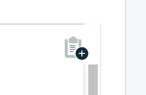

---

copyright:
  years: 2016,2018
lastupdated: "2017-08-03"
---

{:new_window: target="_blank"}
{:shortdesc: .shortdesc}
{:screen: .screen}
{:codeblock: .codeblock}
{:pre: .pre}
{:tip: .tip}

# Verbindung mit Robo3T herstellen

Robo 3T (früher Robomongo) ist eine kostenfreie, einfache GUI für MongoDB. Ihr Schwerpunkt liegt auf der Ausführung von Abfragen, der Erstellung von Indizes und der Anzeige von Dokumenten.

1. Installieren Sie [Robo3T](https://robomongo.org/).
2. Wechseln Sie auf die Seite _Übersicht_ Ihres Service-Dashboards. Auf dieser Registerkarte finden Sie alle Informationen, die Sie zum Herstellen einer Verbindung mit Robo3T benötigen.

  

3. Klicken Sie in der Anzeige _Verbindungszeichenfolgen_ auf **SSL-Zertifikate**, um die Registerkarte 'SSL-Zertifikate' zu öffnen. Speichern Sie das SSL-Zertifikat für Ihren Service. Kopieren Sie zuerst das SSL-Zertifikat über die Kopierschaltfläche rechts oben in der Anzeige 'SSL-Zertifikat':

    

  Erstellen Sie dann mit Ihrem bevorzugten Texteditor eine neue Datei, fügen Sie den Inhalt des SSL-Zertifikats in diese Datei ein und speichern Sie sie.

4. Öffnen Sie Robo3T und navigieren Sie auf die Seite _Verbindungseinstellungen_. Um diese Felder ausfüllen zu können, benötigen Sie einen Hostnamen und eine Portnummer. Kehren Sie dazu auf die Seite _Übersicht_ Ihres Service-Dashboards zurück. Sie finden diese Angaben in der Anzeige _Verbindungseinstellungen_ auf der Registerkarte 'Befehlszeile'.

5. Kopieren Sie die Werte in die Adressfelder auf der Registerkarte _Verbindungseinstellungen_.

  

  Behalten Sie "Direktverbindung" als Einstellung für den _Typ_ bei.
  {: tip}

6. Öffnen Sie die Registerkarte _Authentifizierung_. Um diese Felder ausfüllen zu können, benötigen Sie einen Benutzernamen und ein Kennwort. Kehren Sie dazu auf die Seite _Übersicht_ Ihres Service-Dashboards zurück. Sie finden Ihren Benutzernamen und Ihr Kennwort in der Anzeige _Verbindungseinstellungen_ auf der Registerkarte 'Befehlszeile'.

7. Stellen Sie sicher, dass das Kontrollkästchen _Authentifizierung ausführen_ aktiviert ist, und geben Sie die Werte für den Benutzernamen und das Kennwort über Ihre Befehlszeilenzeichenfolge ein.

  

8. Öffnen Sie die Registerkarte _SSL_. Stellen Sie sicher, dass das Kontrollkästchen _SSL-Protokoll verwenden_ aktiviert und die _Authentifizierungsmethode_ auf "CA-Zertifikat verwenden" eingestellt ist.

  

9. Machen Sie eine Eingabe im Feld _CA-Zertifikat_ oder wechseln Sie an die Position der erstellten SSL-Zertifikatsdatei.

10. Klicken Sie zum Abschluss auf **Speichern**.

