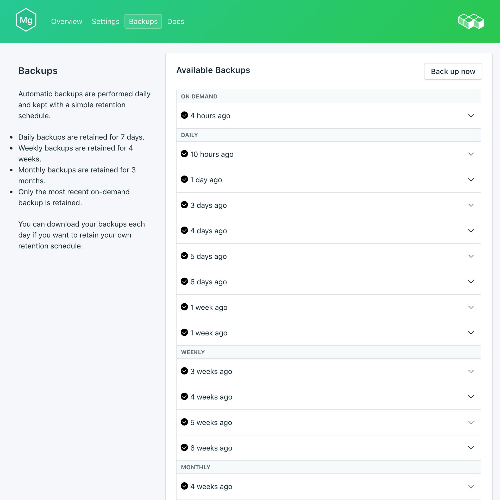
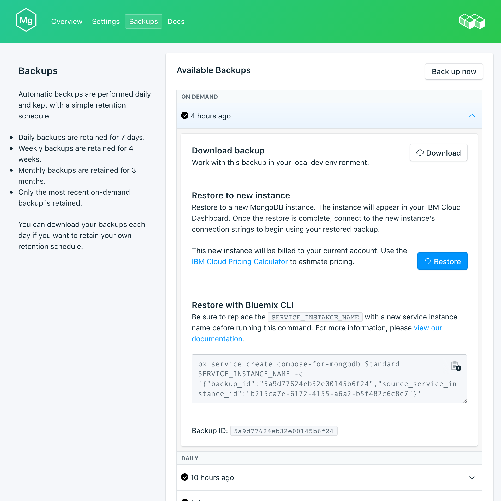

---

copyright:
  years: 2017
lastupdated: "2017-09-07"
---

{:new_window: target="_blank"}
{:shortdesc: .shortdesc}
{:screen: .screen}
{:codeblock: .codeblock}
{:pre: .pre}
{:tip: .tip}

# Sicherungen
{: #backups}

Sie können Sicherungen erstellen und über die Seite *Verwalten* Ihres {{site.data.keyword.composeForMongoDB_full}}-Service-Dashboards herunterladen. Es sind sowohl geplante als auch manuelle Sicherungen verfügbar.

## Vorhandene Sicherungen anzeigen

Tägliche Sicherungen Ihrer Datenbank werden automatisch geplant. Navigieren Sie zum Anzeigen Ihrer vorhandenen Sicherungen zu der Seite *Verwalten* Ihres Service-Dashboards. 

Klicken Sie in eine Zeile, um die Optionen für die entsprechende verfügbare Sicherung zu erweitern.
  
 

## Sicherung bedarfsgerecht erstellen

Neben geplanten Sicherungen können Sie manuelle Sicherungen erstellen. Navigieren Sie zum Erstellen einer manuellen Sicherung zu der Seite *Verwalten* Ihres Service-Dashboards und klicken Sie auf *Jetzt sichern*.

## Sicherung herunterladen

Navigieren Sie zum Herunterladen einer Sicherung zu der Seite *Verwalten* Ihres Service-Dashboards und klicken Sie in der entsprechenden Zeile mit der Sicherung, die Sie herunterladen wollen, auf *Herunterladen*.

## Sicherung mit lokaler Datenbank verwenden

Sie können mit Ihrer {{site.data.keyword.composeForMongoDB}}-Sicherung eine lokale Kopie Ihrer Datenbank ausführen.

Gehen Sie wie folgt vor, um eine lokale Wiederherstellung Ihrer Datenbanken und Daten durchzuführen: 

1. Laden Sie eine Sicherung aus Ihrem Service-Dashboard herunter.
2. Installieren Sie MongoDB und die MongoDB-Tools lokal.
3. Extrahieren Sie die Daten aus der Sicherung in ein neues Verzeichnis.
4. Starten Sie mit dem Befehl `mongod --dbpath ./db` eine lokale MongoDB-Instanz. Dabei ist './db' das Verzeichnis, das die extrahierten Daten enthält.

## Sicherung wiederherstellen

Führen Sie zum Wiederherstellen einer Sicherung in eine neue Serviceinstanz die Schritte zum Anzeigen der vorhandenen Sicherungen aus. Klicken Sie dann in die entsprechende Zeile, um die Optionen für die Sicherung zu erweitern, die Sie herunterladen wollen. Klicken Sie auf die Schaltfläche **Wiederherstellen**. Es wird eine Nachricht darüber angezeigt, dass eine Wiederherstellung eingeleitet wurde. Die neue Serviceinstanz erhält automatisch den Namen "mongodb-restore-[timestamp]" und wird beim Start der Bereitstellung in Ihrem Dashboard angezeigt.
