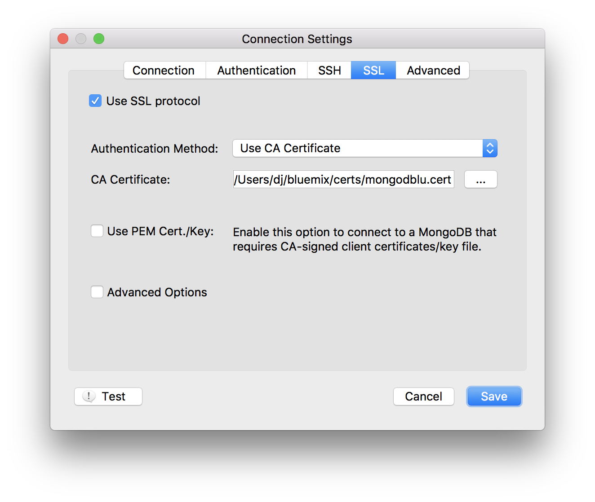

---

copyright:
  years: 2016,2018
lastupdated: "2017-08-03"
---

{:new_window: target="_blank"}
{:shortdesc: .shortdesc}
{:screen: .screen}
{:codeblock: .codeblock}
{:pre: .pre}
{:tip: .tip}

# Conexión con Robo3T

Robo 3T (antes denominado Robomongo) es una GUI ligera gratuita para MongoDB. Su principal objetivo es ejecutar consultas, crear índices y visualizar documentos.

1. Instale [Robo3T](https://robomongo.org/).
2. Vaya a la página _Visión general_ del panel de control del servicio. Toda la información que necesita para conectarse mediante Robo3T está en este separador.

  

3. En el panel _Series de conexión_, pulse **Certificados SSL** para abrir el separador Certificados SSL. Guarde el certificado SSL para el servicio. En primer lugar, copie el certificado SSL utilizando el botón Copiar de la esquina superior derecha del panel del certificado SSL:

    

  Luego, con el editor de texto que prefiera, cree un archivo nuevo, pegue el contenido del certificado SSL en el archivo y guarde el archivo.

4. Abra Robo3T y vaya al separador _Valores de conexión_. Para completar estos campos, necesitará un nombre de host y un número de puerto. De nuevo en la página _Visión general_ del panel de control del servicio, encontrará estos valores en el separador Línea de mandatos, en el panel _Valores de conexión_.

5. Copie los valores en los campos de direcciones del separador _Valores de conexión_.

  

  Deje el valor _Tipo_ como "Conexión directa"
  {: tip}

6. Abra el separador _Autenticación_. Para completar estos campos, necesitará un nombre de usuario y una contraseña. De nuevo en la página _Visión general_ del panel de control del servicio, encontrará su nombre de usuario y contraseña en el separador Línea de mandatos, en el panel _Valores de conexión_.

7. Asegúrese de que el recuadro _Realizar autenticación_ está seleccionado y especifique los valores de Nombre de usuario y Contraseña de la serie de la línea de mandatos.

  

8. Abra el separador _SSL_. Asegúrese de que el recuadro _Utilizar protocolo SSL_ está marcado y el recuadro _Método de autenticación_ está establecido en "Utilizar certificado de CA".

  

9. Utilice el campo _Certificado de CA_ para especificar o buscar la ubicación del archivo de certificado SSL que ha creado.

10. Pulse **Guardar** para finalizar.

