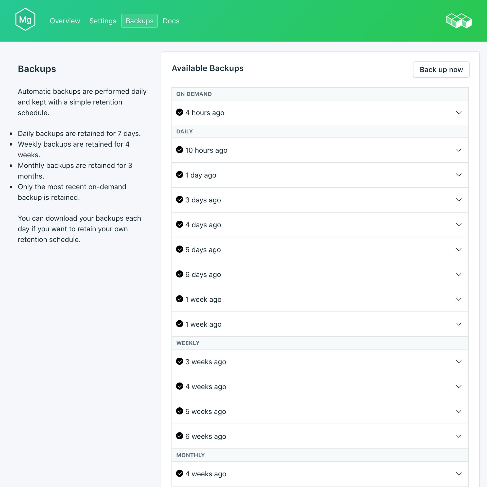

---

copyright:
  years: 2017
lastupdated: "2017-09-07"
---

{:new_window: target="_blank"}
{:shortdesc: .shortdesc}
{:screen: .screen}
{:codeblock: .codeblock}
{:pre: .pre}
{:tip: .tip}

# Copias de seguridad
{: #backups}

Puede crear y descargar copias de seguridad desde la página *Gestionar* del panel de control del servicio {{site.data.keyword.composeForMongoDB_full}}. Dispone de copias de seguridad planificadas y manuales.

## Visualización de las copias de seguridad existentes

Se planifican automáticamente copias de seguridad diarias de la base de datos. Para ver las copias de seguridad existentes, vaya a la página *Gestionar* del panel de control del servicio. 

Pulse en la fila correspondiente para ampliar las opciones para cualquier copia de seguridad disponible.
  
 

## Creación de una copia de seguridad a petición

Además de copias de seguridad planificadas, puede crear una copia de seguridad manualmente. Para crear una copia de seguridad manual, vaya a la página *Gestionar* del panel de control del servicio y pulse *Copia de seguridad ahora*.

## Descarga de una copia de seguridad

Para descargar una copia de seguridad, vaya a la página *Gestionar* del panel de control del servicio y pulse *Descargar* en la fila correspondiente a la copia de seguridad que desea descargar.

## Utilización de una copia de seguridad con una base de datos local

Puede utilizar la copia de seguridad de {{site.data.keyword.composeForMongoDB}} para ejecutar una copia local de la base de datos.

Para obtener una restauración local de las bases de datos y los datos:

1. Descargue una copia de seguridad del panel de control del servicio.
2. Instale las herramientas MongoDB y MongoDB localmente.
3. Extraiga los datos de la copia de seguridad en un directorio nuevo.
4. Inicie una instancia de MongoDB local con el mandato `mongod --dbpath ./db`, donde './db' es el directorio que contiene los datos extraídos.

## Restauración de una copia de seguridad

Para restaurar una copia de seguridad en una nueva instancia de servicio, siga los pasos para ver las copias de seguridad existentes y luego pulse en la fila correspondiente para ampliar las opciones para la copia de seguridad que desea descargar. Pulse el botón **Restaurar**. Se mostrará un mensaje que le indicará que se ha iniciado una restauración. A la nueva instancia del servicio se le asignará automáticamente el nombre "mongodb-restore-[timestamp]" y aparecerá en el panel de control cuando comience el suministro.
