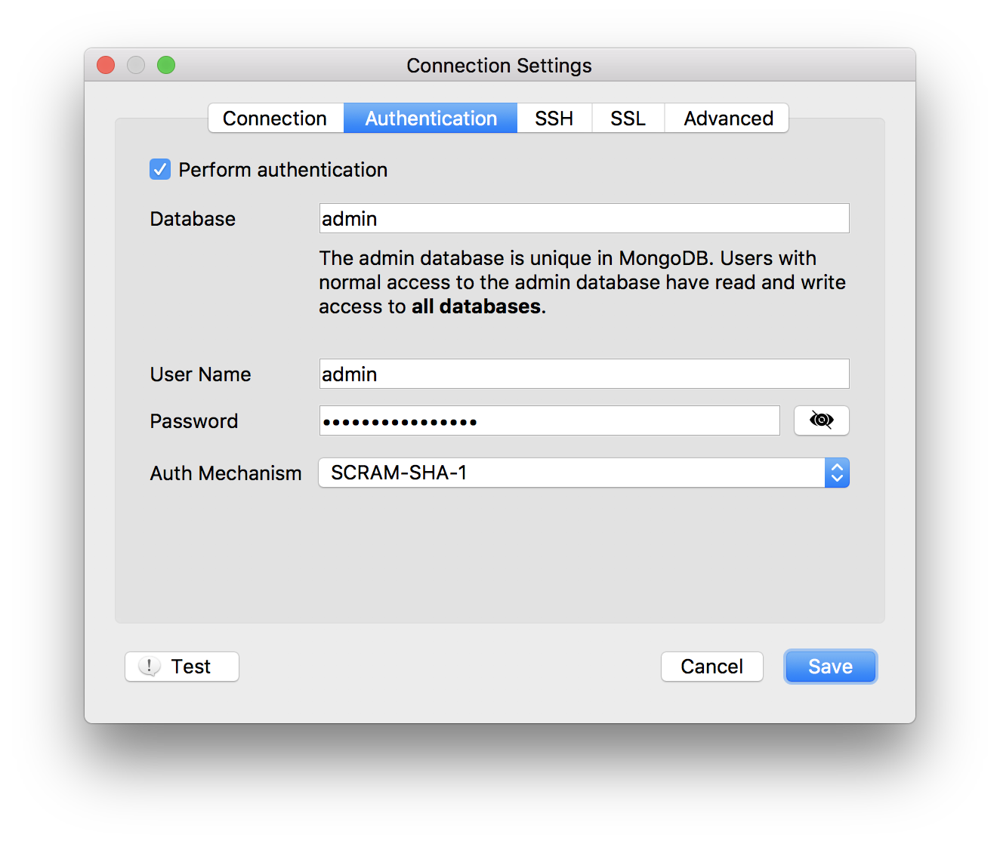

---

copyright:
  years: 2016,2018
lastupdated: "2017-08-03"
---

{:new_window: target="_blank"}
{:shortdesc: .shortdesc}
{:screen: .screen}
{:codeblock: .codeblock}
{:pre: .pre}
{:tip: .tip}

# Connexion avec Robo3T

Robo 3T (anciennement Robomongo) est une interface graphique utilisateur simple gratuite pour MongoDB. Elle a pour principale fonction l'exécution de requêtes, la création d'index et l'affichage de documents.

1. Installez [Robo3T](https://robomongo.org/).
2. Accédez à la page _Vue d'ensemble_ du tableau de bord de votre service. Cette page contient toutes les informations dont vous avez besoin pour vous connecter à l'aide de Robo3T.

  

3. Dans le panneau _Chaînes de connexion_, cliquez sur **Certificats SSL** pour ouvrir l'onglet Certificats SSL. Sauvegardez le certificat SSL pour votre service. Commencez par copier le certificat SSL en cliquant sur le bouton de copie situé dans l'angle supérieur droit du panneau de certificat SSL :

    

  Ensuite, à l'aide de votre éditeur de texte préféré, créez un nouveau fichier, collez le contenu du certificat SSL dans ce fichier, puis sauvegardez le fichier.

4. Ouvrez Robo3T et accédez à l'onglet _Connection Settings_. Pour renseigner les zones de cet onglet, vous avez besoin d'un nom d'hôte et d'un numéro de port. Vous trouverez ces informations dans l'onglet Ligne de commande du panneau _Connection Settings_ lorsque vous revenez sur la page _Vue d'ensemble_ du tableau de bord de votre service.

5. Copiez les valeurs dans les zones d'adresse de l'onglet _Connection Settings_.

  

  Conservez la valeur "Direct Connection" dans la zone _Type_.
  {: tip}

6. Ouvrez l'onglet _Authentification_. Pour renseigner les zones de cet onglet, vous avez besoin d'un nom d'utilisateur et d'un mot de passe. Vous trouverez ces informations dans l'onglet Ligne de commande du panneau _Connection Settings_ lorsque vous revenez sur la page _Vue d'ensemble_ du tableau de bord de votre service.

7. Assurez-vous que la case _Perform authentication_ est cochée et entrez le nom d'utilisateur et le mot de passe de votre chaîne de ligne de commande.

  

8. Ouvrez l'onglet _SSL_. Assurez-vous que la case _Use SSL protocol_ est cochée et que _Authentication Method_ est défini sur "Use CA Certificate".

  

9. Utilisez la zone _CA Certificate_ pour entrer ou rechercher l'emplacement du fichier de certificat SSL que vous avez créé.

10. Cliquez sur **Sauvegarder** pour terminer.

