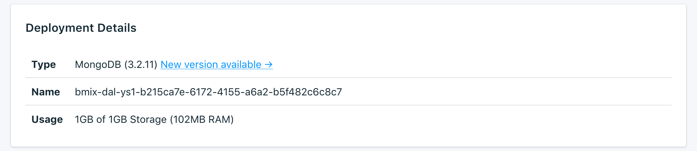

---

Copyright:
  Years: 2017
lastupdated: "2017-10-23"
---

{:new_window: target="_blank"}
{:shortdesc: .shortdesc}
{:screen: .screen}
{:codeblock: .codeblock}
{:pre: .pre}

# Présentation du service

La page _Vue d'ensemble_ affiche des informations concernant la base de données Compose d'{{site.data.keyword.cloud}}. La vue d'ensemble contient des informations d'identification essentielles et indique l'utilisation actuelle des ressources. Vous y trouverez également une section qui contient les chaînes de connexion que vous pouvez utiliser avec les outils pour vous connecter à votre base de données.

## Deployment Details

Le panneau _Deployment Details_ affiche des détails concernant votre déploiement.



### Type

Type de base de données fourni par le service et version de base de données qu'utilise votre service.

### Nom

Identificateur interne du service.

### Utilisation

Taille de votre base de données et quantité de stockage fournie par le plan de service.


## Chaînes de connexion

Les chaînes de connexion disponibles pour votre service se trouvent dans une série d'onglets du panneau _Chaînes de connexion_. Pour savoir comment utiliser une chaîne de connexion pour vous connecter à votre service, voir [Connexion d'une application externe](./connecting-external.html).

### HTTPS

Chaîne de connexion **HTTPS**, qui peut être utilisée par certaines bibliothèques client et qui contient toutes les informations requises pour la connexion d'autres bibliothèques. 

### Chaîne de connexion

Vous pouvez utiliser votre chaîne de connexion directement dans une application pour vous connecter à {{site.data.keyword.composeForMongoDB}} ou la définir en tant que variable d'environnement. Pour ce faire, exécutez la commande suivante dans le shell :

```
export MONGODB_URL="<CONNECTION STRING>"
```

### Ligne de commande

Une **ligne de commande** est une commande préformatée qui appellera `mongo` avec les paramètres appropriés. Pour l'utiliser, les outils Mongo doivent être installés sur le système local. Pour plus d'informations sur la procédure à suivre, voir [Connexion d'une application externe](./connecting-external.html).

### Certificat SSL

Le service Compose {{site.data.keyword.cloud_notm}} vous fournit un certificat SSL qui vous permet de vous connecter à votre base de données.
