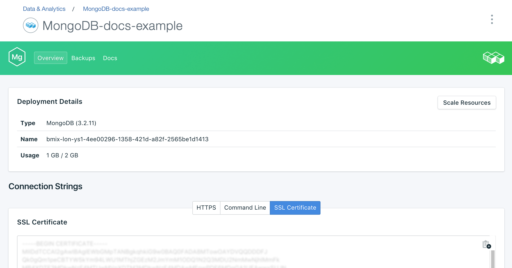

---

copyright:
  years: 2016,2017
lastupdated: "2017-08-03"
---

{:new_window: target="_blank"}
{:shortdesc: .shortdesc}
{:screen: .screen}
{:codeblock: .codeblock}
{:pre: .pre}
{:tip: .tip}

# Robo3T による接続

Robo 3T (旧称 Robomongo) は、MongoDB に対応した無料の軽量 GUI です。主に、照会の実行、索引の作成、文書の表示に重点を置いています。

1. [Robo3T](https://robomongo.org/) をインストールします。
2. サービス・ダッシュボードの_「概要」_ページに移動します。Robo3T を使用した接続に必要なすべての情報がこのタブにあります。

  

3. _「接続ストリング」_パネルで**「SSL 証明書」**をクリックして、「SSL 証明書」タブを開きます。サービスの SSL 証明書を保存します。まず、「SSL 証明書」パネルの右上隅にあるコピー・ボタンを使用して SSL 証明書をコピーします。

    

  次に、好みのテキスト・エディターを使用して新しいファイルを作成し、SSL 証明書の内容をそのファイルに貼り付けて、そのファイルを保存します。

4. Robo3T を開いて、_「接続ストリング」_タブに移動します。各フィールドに値を入力するために、ホスト名とポート番号が必要になります。サービス・ダッシュボードの_「概要」_ページに戻り、_「接続ストリング」_パネルの「コマンド・ライン」タブを見れば、その情報を確認できます。

5. その値を_「接続ストリング」_タブのアドレス・フィールドにコピーします。

  

  _「タイプ」_の設定は「直接接続」のままにしておきます。
  {: tip}

6. _「認証」_タブを開きます。各フィールドに値を入力するために、ユーザー名とパスワードが必要になります。サービス・ダッシュボードの_「概要」_ページに戻って、_「接続ストリング」_パネルの「コマンド・ライン」タブを見れば、ユーザー名とパスワードを確認できます。

7. _「認証の実行」_ボックスにチェック・マークが付いていることを確認し、コマンド・ライン・ストリングに含まれているユーザー名とパスワードの値を入力します。

  

8. _「SSL」_タブを開きます。_「SSL プロトコルの使用」_ボックスにチェック・マークが付いていることを確認し、_「認証方式」_を「CA 証明書の使用」に設定します。

  

9. _「CA 証明書」_フィールドに、作成した SSL 証明書ファイルの場所を入力するか、その場所を参照して選択します。

10. **「保存」**をクリックして終了します。

