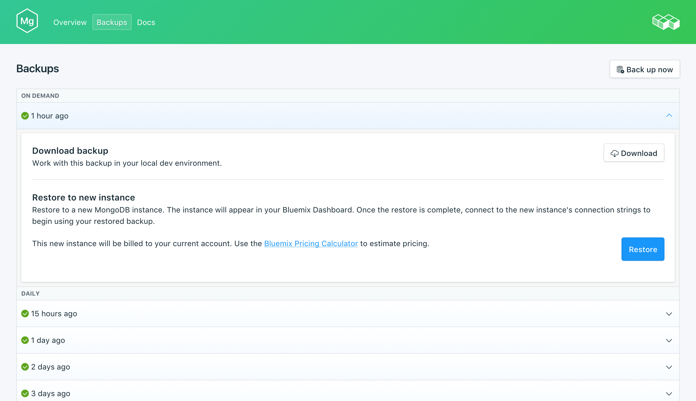

---

copyright:
  years: 2017
lastupdated: "2017-09-07"
---

{:new_window: target="_blank"}
{:shortdesc: .shortdesc}
{:screen: .screen}
{:codeblock: .codeblock}
{:pre: .pre}
{:tip: .tip}

# 백업
{: #backups}

{{site.data.keyword.composeForMongoDB_full}} 서비스 대시보드의 *관리* 페이지에서 백업을 작성하고 다운로드할 수 있습니다. 스케줄된 백업과 수동 백업이 모두 사용 가능합니다.

## 기존 백업 보기

데이터베이스의 일간 백업이 자동으로 스케줄됩니다. 기존 백업을 보려면 서비스 대시보드의 *관리* 페이지로 이동하십시오. 

해당 행을 클릭하여 사용 가능한 백업에 대한 옵션을 펼치십시오.
  
 

## 요청 시 백업 작성

스케줄된 백업은 물론 수동으로 백업을 작성할 수도 있습니다. 수동 백업을 작성하려면 서비스 대시보드의 *관리* 페이지로 이동하여 *지금 백업*을 클릭하십시오.

## 백업 다운로드

백업을 다운로드하려면 서비스 대시보드의 *관리* 페이지로 이동하여 다운로드할 백업에 해당하는 행에서 *다운로드*를 클릭하십시오. 

## 로컬 데이터베이스에 백업 사용

{{site.data.keyword.composeForMongoDB}} 백업을 사용하여 데이터베이스의 로컬 사본을 실행할 수 있습니다.

데이터베이스 및 데이터의 로컬 복원을 가져오려면 다음을 수행하십시오.

1. 서비스 대시보드에서 백업을 다운로드하십시오.
2. 로컬로 MongoDB 및 MongoDB 도구를 설치하십시오.
3. 새 디렉토리에 백업 데이터의 압축을 푸십시오.
4. `mongod --dbpath ./db` 명령을 사용하여 로컬 MongoDB 인스턴스를 시작하십시오. 여기서 './db'는 추출된 데이터가 포함된 디렉토리입니다.

## 백업 복원

백업을 새 서비스 인스턴스에 복원하려면 단계에 따라 기존 백업을 확인한 후 해당 행을 클릭하여 다운로드할 백업에 대한 옵션을 펼치십시오. **복원** 단추를 클릭하십시오. 복원이 시작되었음을 알리는 메시지가 표시됩니다. 새 서비스 인스턴스가 자동으로 "mongodb-restore-[timestamp]"로 이름 지정되고 프로비저닝이 시작될 때 대시보드에 표시됩니다.
