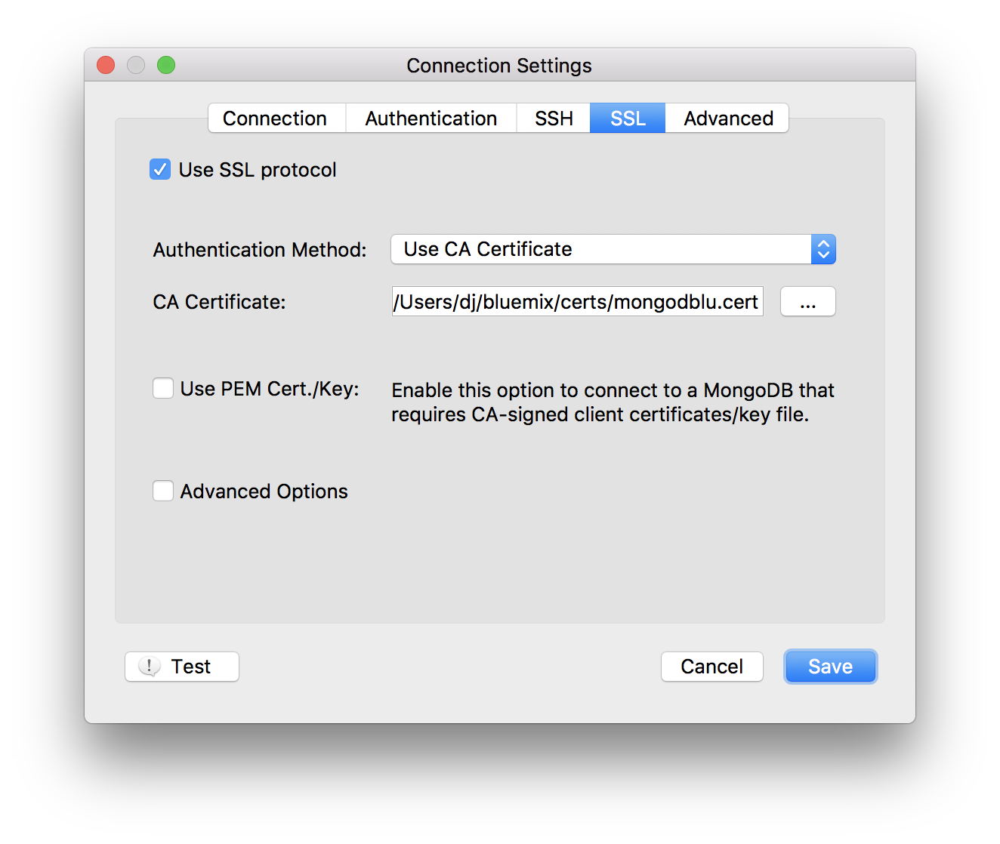

---

copyright:
  years: 2016,2018
lastupdated: "2017-08-03"
---

{:new_window: target="_blank"}
{:shortdesc: .shortdesc}
{:screen: .screen}
{:codeblock: .codeblock}
{:pre: .pre}
{:tip: .tip}

# Conectando com Robo3T

Robo 3T (anteriormente Robomongo) é uma GUI leve e grátis para MongoDB. O foco principal é executar consultas, criar índices e visualizar documentos.

1. Instale o [Robo3T](https://robomongo.org/).
2. Acesse a página _Visão geral_ em seu painel de serviço. Todas as informações que você precisa para se conectar usando o Robo3T podem ser localizadas nessa guia.

  

3. No painel _Sequências de conexões_, clique em **SSL Certificates** para abrir a guia SSL Certificates. Salve o certificado SSL para seu serviço. Primeiro, copie o certificado SSL usando o botão copiar no canto superior direito do painel do certificado SSL:

    

  Em seguida, usando seu editor de texto preferencial, crie um novo arquivo, cole os conteúdos do certificado SSL no arquivo e salve o arquivo.

4. Abra o Robo3T e navegue para a guia _Configurações de conexão_. Para concluir os campos aqui, você precisará de um nome do host e número da porta. De volta na página _Visão geral_ de seu painel de serviço, você os localizará na guia Linha de comandos, no painel _Configurações de conexão_.

5. Copie os valores nos campos de Endereço na guia _Configurações de conexão_.

  

  Deixe a configuração _Tipo_ como "Conexão direta"
  {: tip}

6. Abra a guia _Autenticação_. Para concluir os campos aqui, você precisará de um nome do usuário e senha. De volta na página _Visão geral_ de seu painel de serviço, você localizará seu nome do usuário e senha na guia Linha de comandos, no painel _Configurações de conexão_.

7. Certifique-se de que a caixa _Executar autenticação_ esteja marcada e insira os valores de Nome do usuário e Senha de sua sequência de linha de comandos.

  

8. Abra a guia _SSL_. Certifique-se de que a caixa _Usar protocolo SSL_ esteja marcada e _Método de autenticação_ esteja configurado para "Usar certificado de CA".

  

9. Use o campo _Certificado de CA_ para inserir ou procurar o local do arquivo de certificado SSL que você criou.

10. Clique em **Salvar** para concluir.

