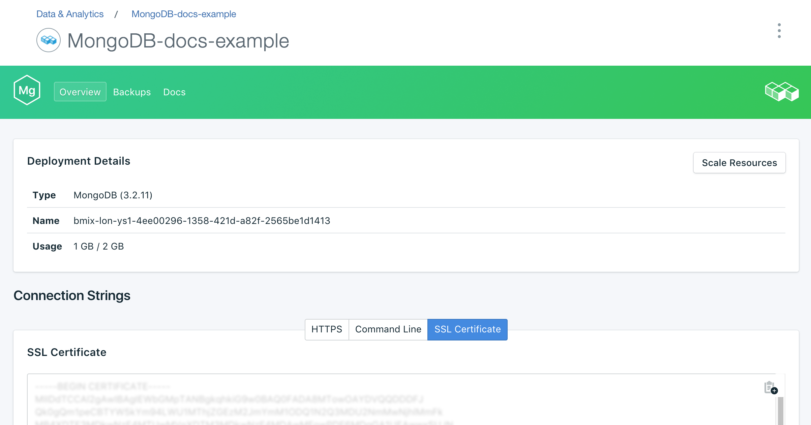
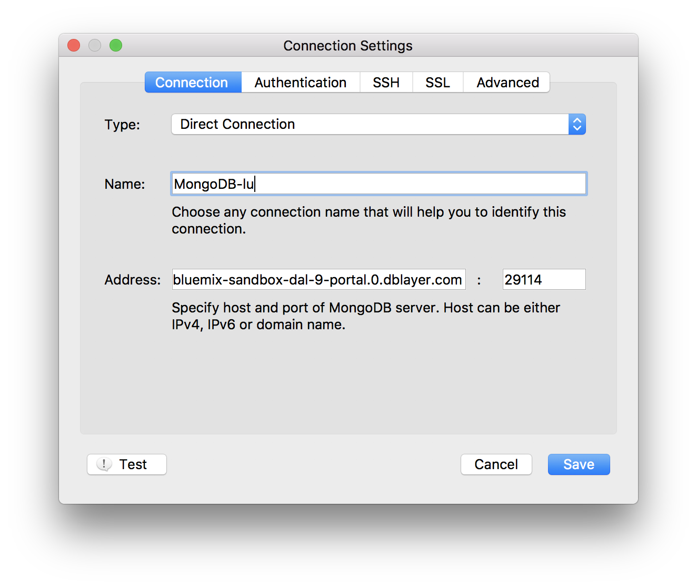

---

copyright:
  years: 2016,2018
lastupdated: "2017-08-03"
---

{:new_window: target="_blank"}
{:shortdesc: .shortdesc}
{:screen: .screen}
{:codeblock: .codeblock}
{:pre: .pre}
{:tip: .tip}

# 使用 Robo3T 进行连接

Robo 3T（前身是 Robomongo）是 MongoDB 的免费轻量级 GUI。它的重点主要放在运行查询、创建索引和查看文档上。

1. 安装 [Robo3T](https://robomongo.org/)。
2. 转至服务仪表板的_概述_页面。使用 Robo3T 进行连接所需的所有信息都可在此选项卡上找到。

  

3. 在_连接字符串_面板中，单击 **SSL 证书**以打开“SSL 证书”选项卡。保存服务的 SSL 证书。首先，使用 SSL 证书面板右上角的复制按钮复制 SSL 证书：

    

  然后，使用首选的文本编辑器创建一个新文件，将 SSL 证书内容粘贴到该文件中，然后保存该文件。

4. 打开 Robo3T 并浏览到_连接设置_选项卡。要在此处填写这些字段，您需要主机名和端口号。返回到服务仪表板的_概述_页面，您将在_连接设置_面板的“命令行”选项卡中找到这些信息。

5. 将值复制到_连接设置_选项卡的“地址”字段中。

  

  将_类型_设置保留为“直接连接”
  {: tip}

6. 打开_认证_选项卡。要在此处填写这些字段，您需要用户名和密码。返回到服务仪表板的_概述_页面，您将在_连接设置_面板的“命令行”选项卡中找到用户名和密码。

7. 确保选中_执行认证_框，然后从命令行字符串输入“用户名”和“密码”值。

  

8. 打开 _SSL_ 选项卡。确保选中了_使用 SSL 协议_框，并且_认证方法_设置为“使用 CA 证书”。

  

9. 使用 _CA 证书_字段以输入或浏览到您创建 SSL 证书文件的位置。

10. 单击**保存**以完成。

