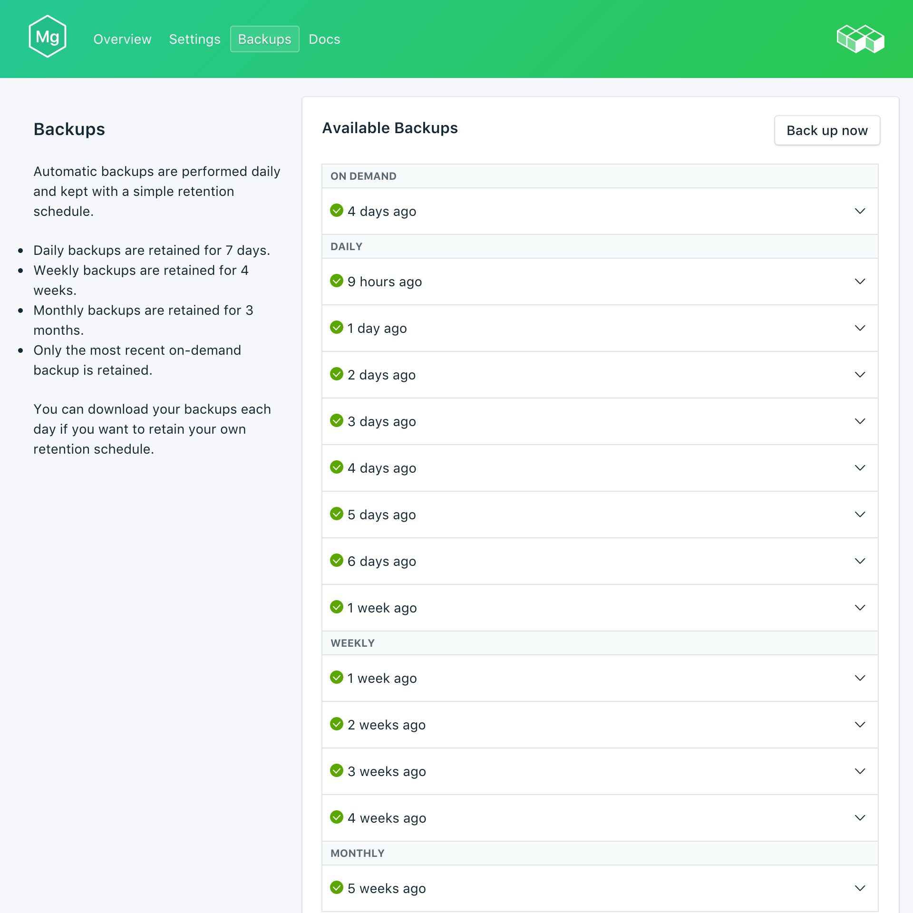
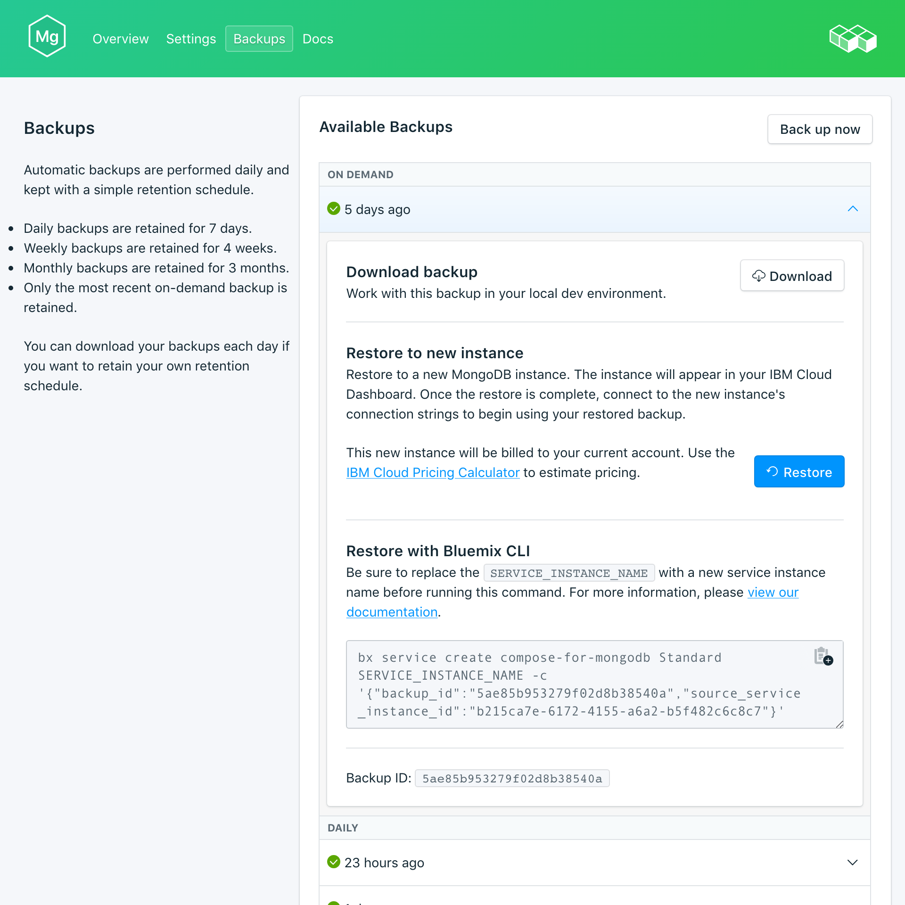

---

copyright:
  years: 2017
lastupdated: "2017-09-07"
---

{:new_window: target="_blank"}
{:shortdesc: .shortdesc}
{:screen: .screen}
{:codeblock: .codeblock}
{:pre: .pre}
{:tip: .tip}

# 备份
{: #backups}

您可以从 {{site.data.keyword.composeForMongoDB_full}} 服务仪表板的*管理*页面创建和下载备份。可以使用安排的备份和手动备份。

## 查看现有备份

数据库的每日备份会自动安排。要查看现有备份，请浏览至服务仪表板的*管理*页面。 

单击相应的行以展开任何可用备份的选项。
  
 

## 随需应变创建备份

除了已安排的备份，您还可以手动创建备份。要创建手动备份，请浏览至服务仪表板的*管理*页面，然后单击*立即备份*。

## 下载备份

要下载备份，请浏览至服务仪表板的*管理*页面，然后单击要下载的备份相应行中的*下载*。

## 将备份与本地数据库配合使用

您可以使用 {{site.data.keyword.composeForMongoDB}} 备份来运行数据库的本地副本。

要获取数据库和数据的本地复原，请执行以下操作：

1. 从服务仪表板下载备份。
2. 在本地安装 MongoDB 和 MongoDB 工具。
3. 将数据从备份抽取到新目录中。
4. 使用命令 `mongod --dbpath ./db` 启动本地 MongoDB 实例，其中“./db”是包含所抽取数据的目录。

## 复原备份

要将备份复原到新服务实例，请执行以下步骤以查看现有备份，然后单击相应的行以展开要下载的备份的选项。单击**复原**按钮。此时将显示一条消息，通知您已启动复原。新服务实例将自动命名为“mongodb-restore-[timestamp]”，并在供应启动时显示在仪表板上。
