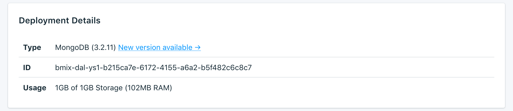

---

Copyright:
  Years: 2017
lastupdated: "2017-10-23"
---

{:new_window: target="_blank"}
{:shortdesc: .shortdesc}
{:screen: .screen}
{:codeblock: .codeblock}
{:pre: .pre}

# 服务概述

_概述_页面显示有关 {{site.data.keyword.cloud}} Compose 数据库的信息。此概述包含基本的标识信息和当前资源使用情况。您还将找到一个用于连接字符串的部分，您可以将这些连接字符串与工具一起使用，也可以使用工具来连接到数据库。

## 部署详细信息

_部署详细信息_面板显示服务的详细信息。



### 类型

服务所提供的数据库类型，以及服务所使用的数据库版本。

### 名称

服务的内部标识。

### 使用情况

数据库的大小和服务套餐所提供的存储量。


## 连接字符串

您可以在_连接字符串_面板的一组选项卡中找到服务可用的连接字符串。您可以在[连接外部应用程序](./connecting-external.html)中找到如何使用连接字符串连接到服务的信息。

### HTTPS

**HTTPS** 连接字符串可由某些客户机库使用，并包含其他库连接所需的所有信息。

### 连接字符串

您可以直接在应用程序中使用连接字符串来连接到 {{site.data.keyword.composeForMongoDB}}，也可以将其设置为环境变量。要这样做，请在 shell 中执行以下操作：

```
export MONGODB_URL="<CONNECTION STRING>"
```

### 命令行

**命令行**是一个预先格式化的命令，它将使用正确的参数来调用 `mongo`。要使用它，您需要在本地系统上安装 mongo 工具。您可以在[连接外部应用程序](./connecting-external.html)中找到有关如何执行此操作的更多信息。

### SSL 证书

您的 Compose {{site.data.keyword.cloud_notm}} 服务为您提供了可用于连接到数据库的 SSL 证书。
