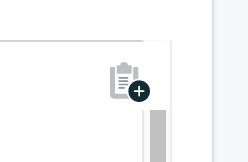

---

copyright:
  years: 2016,2017
lastupdated: "2017-08-03"
---

{:new_window: target="_blank"}
{:shortdesc: .shortdesc}
{:screen: .screen}
{:codeblock: .codeblock}
{:pre: .pre}
{:tip: .tip}

# 使用 Robo3T 連接

Robo 3T（前身為 Robomongo）是一個適用於 MongoDB 的免費輕量型 GUI。其主要焦點為執行查詢、建立索引及檢視文件。

1. 安裝 [Robo3T](https://robomongo.org/)。
2. 移至服務儀表板的_概觀_ 頁面。在此標籤上，可以找到使用 Robo3T 進行連接所需的一切資訊。

  

3. 在_連線字串_ 畫面中，按一下 **SSL 憑證**來開啟「SSL 憑證」標籤。儲存服務的 SSL 憑證。首先，使用 SSL 憑證畫面右上角的複製按鈕來複製 SSL 憑證：

    

  然後，使用您偏好的文字編輯器，建立新檔案、將 SSL 憑證內容貼至檔案，然後儲存檔案。

4. 開啟 Robo3T，並導覽至_連線設定_ 標籤。若要在這裡完成欄位，您將需要主機名稱和埠號。回到服務儀表板的_概觀_ 頁面，您會在「指令行」標籤的_連線設定_ 畫面中找到主機名稱和埠號。

5. 將這些值複製到_連線設定_ 標籤中的「位址」欄位。

  

  將_類型_ 設定保留為「直接連線」
  {: tip}

6. 開啟_鑑別_ 標籤。若要在這裡完成欄位，您將需要使用者名稱和密碼。回到服務儀表板的_概觀_ 頁面，您會在「指令行」標籤的_連線設定_ 畫面中找到您的使用者名稱和密碼。

7. 確定已勾選_執行鑑別_ 方框，然後從指令行字串輸入「使用名稱」和「密碼」值。

  

8. 開啟 _SSL_ 標籤。確定已勾選_使用 SSL 通訊協定_ 方框，且_鑑別方法_ 設為「使用 CA 憑證」。

  

9. 使用 _CA 憑證_ 欄位輸入或瀏覽至您建立之 SSL 憑證檔的位置。

10. 按一下**儲存**以完成。

