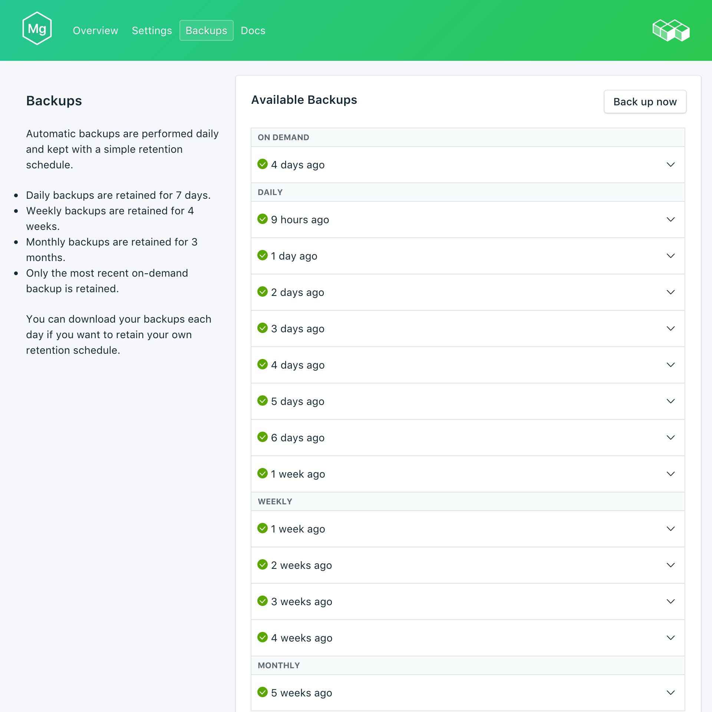

---

copyright:
  years: 2017
lastupdated: "2017-09-07"
---

{:new_window: target="_blank"}
{:shortdesc: .shortdesc}
{:screen: .screen}
{:codeblock: .codeblock}
{:pre: .pre}
{:tip: .tip}

# 備份
{: #backups}

您可以從 {{site.data.keyword.composeForMongoDB_full}} 服務儀表板的*管理*頁面中建立及下載備份。提供有排程備份及手動備份。

## 檢視現有備份

資料庫的每日備份是自動排定的。若要檢視現有備份，請導覽至服務儀表板的*管理* 頁面。 

按一下對應列來展開任何可用備份的選項。
  
 

## 依需求建立備份

除了排程備份外，您也可以手動建立備份。若要建立手動備份，請導覽至服務儀表板的*管理* 頁面，然後按一下*立即備份*。

## 下載備份

若要下載備份，請導覽至服務儀表板的*管理* 頁面，然後針對您要下載的備份，按一下對應列中的*下載*。

## 使用備份與本端資料庫搭配

您可以使用 {{site.data.keyword.composeForMongoDB}} 備份來執行資料庫的本端副本。

若要在本端還原資料庫及資料，請執行下列動作：

1. 從服務儀表板下載備份。
2. 在本端安裝 MongoDB 及 MongoDB 工具。
3. 將備份中的資料擷取至新目錄。
4. 使用 `mongod --dbpath ./db` 指令來啟動本端 MongoDB 實例，其中 './db' 是包含已擷取資料的目錄。

## 還原備份

若要將備份還原至新的服務實例，請遵循步驟來檢視現有備份，然後按一下對應列以展開您要下載之備份的選項。按一下**還原**按鈕。即會顯示一則訊息，讓您知道已起始還原。新的服務實例會自動命名為 "mongodb-restore-[timestamp]"，而且在佈建開始時，儀表板上會出現這個實例。
